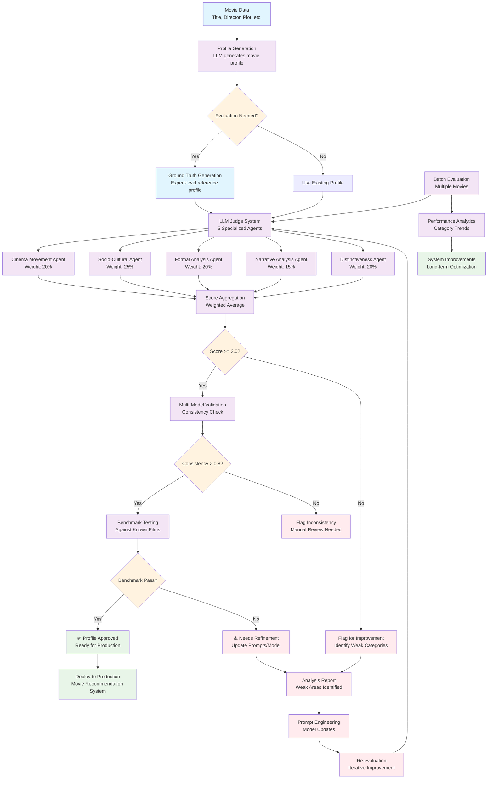
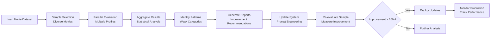

# Movie Profile Evaluation Workflow

## Complete Workflow Diagram



## Workflow Stages

### 1. **Input & Generation Stage**
```
Movie Data → Profile Generation → Ground Truth Creation
```
- Raw movie metadata (title, director, plot, etc.)
- LLM generates initial movie profile
- System creates expert-level reference profile

### 2. **Multi-Agent Evaluation Stage**
```
5 Specialized LLM Agents → Individual Scoring → Weighted Aggregation
```
- **Cinema Movement Agent** (20%): Identifies film movements, techniques
- **Socio-Cultural Agent** (25%): Historical context, social themes
- **Formal Analysis Agent** (20%): Technical innovations, visual style
- **Narrative Analysis Agent** (15%): Story structure, character analysis
- **Distinctiveness Agent** (20%): Unique elements, cultural impact

### 3. **Quality Assurance Stage**
```
Score Threshold → Multi-Model Validation → Benchmark Testing
```
- Minimum score threshold (3.0/5.0)
- Cross-model consistency checking
- Validation against known benchmark films

### 4. **Decision & Deployment Stage**
```
Approval Gate → Production Deployment → Continuous Monitoring
```
- Pass/Fail decision based on quality metrics
- Approved profiles deployed to recommendation system
- Ongoing performance monitoring

### 5. **Feedback & Improvement Loop**
```
Analysis Reports → Prompt Engineering → Re-evaluation
```
- Detailed analysis of weak areas
- Systematic prompt improvements
- Iterative re-evaluation and refinement

## Detailed Process Flow

### Phase 1: Initial Evaluation
1. **Movie Data Input**: Title, director, plot, genres, year
2. **Profile Generation**: Current LLM system generates profile
3. **Ground Truth Creation**: Expert-level reference profile generated
4. **Multi-Agent Evaluation**: 5 specialized agents score the profile

### Phase 2: Quality Validation
1. **Score Aggregation**: Weighted average across all categories
2. **Threshold Check**: Score must be ≥ 3.0 to proceed
3. **Multi-Model Validation**: Consistency check across different LLMs
4. **Benchmark Testing**: Validation against known film examples

### Phase 3: Decision & Action
1. **Quality Gate**: Pass/fail based on comprehensive metrics
2. **Approved Profiles**: Deploy to production system
3. **Failed Profiles**: Flag for improvement and analysis

### Phase 4: Continuous Improvement
1. **Performance Analytics**: Track trends and identify patterns
2. **Weak Area Analysis**: Detailed breakdown of improvement areas
3. **Prompt Engineering**: Systematic refinement of generation prompts
4. **Model Updates**: Iterative improvements to the system

## Batch Processing Workflow



## Quality Metrics Dashboard

### Real-time Metrics
- **Overall Score Distribution**: Average, min, max scores
- **Category Performance**: Individual category trends
- **Consistency Scores**: Multi-model agreement rates
- **Processing Speed**: Evaluations per hour
- **Error Rates**: Failed evaluations, parsing errors

### Weekly Reports
- **Top Performing Categories**: Best-scoring areas
- **Improvement Areas**: Categories needing attention
- **Benchmark Performance**: Comparison to known standards
- **System Reliability**: Uptime, error rates, consistency

### Monthly Analysis
- **Trend Analysis**: Performance over time
- **Prompt Effectiveness**: Impact of prompt changes
- **Model Performance**: Comparison across LLM providers
- **Business Impact**: Correlation with user engagement

## Integration Points

### With Existing System
```
Current Movie Profiles → Evaluation Pipeline → Improved Profiles → Recommendation Engine
```

### API Integration
```
POST /evaluate-profile
{
  "movie_data": {...},
  "generated_profile": "...",
  "options": {
    "use_ground_truth": true,
    "validation_level": "full"
  }
}
```

### Monitoring Integration
```
Evaluation Results → Analytics Dashboard → Alert System → Improvement Pipeline
```

## Success Metrics

### Quality Metrics
- **Average Score**: Target ≥ 4.0/5.0
- **Consistency**: Multi-model agreement ≥ 0.8
- **Benchmark Accuracy**: ≥ 0.85 vs. expert standards
- **Category Balance**: No category consistently below 3.0

### Operational Metrics
- **Processing Speed**: ≥ 100 profiles/hour
- **Error Rate**: < 5% evaluation failures
- **Uptime**: ≥ 99% system availability
- **Cost Efficiency**: < $0.05 per evaluation

### Business Impact
- **User Engagement**: Improved recommendation relevance
- **Profile Quality**: Reduced generic descriptions
- **System Reliability**: Consistent output quality
- **Scalability**: Support for growing movie database

## Implementation Timeline

### Week 1-2: Setup & Testing
- Deploy evaluation system
- Run initial tests with sample movies
- Validate against benchmark films
- Fine-tune scoring thresholds

### Week 3-4: Batch Evaluation
- Evaluate existing movie profiles
- Identify weak areas and patterns
- Generate improvement recommendations
- Begin prompt engineering

### Month 2: Iteration & Improvement
- Implement prompt improvements
- Re-evaluate sample profiles
- Measure improvement metrics
- Deploy enhanced system

### Month 3+: Production & Monitoring
- Full production deployment
- Continuous monitoring
- Regular performance reviews
- Ongoing system optimization

This workflow ensures systematic quality improvement while maintaining operational efficiency and providing clear feedback loops for continuous enhancement of your movie profile generation system.
